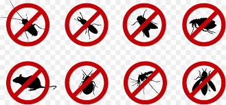
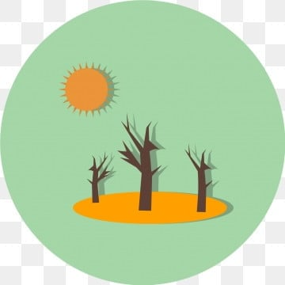
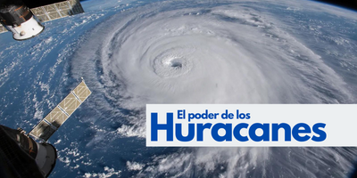

## ¿Que es la proteccion en el medio ambiente?
La proteccion en el medio ambiente consiste en comprender todas las actividades para poder prevenir y controlar la degradacion de la tierra, agua, vegetacion y aire, es decir que se intenta conservar y mejorar el patrimonio natural y artificial como por ejemplo mejorar la diversidad biologica de los ecosistemas, tambien le incluye el humano para que este en buenas condiciones en nuestro mundo y sistema 

## ¿Cuáles son los riesgos ambientales?
Antes que nada un riesgo ambiental es una catastrofe en el medio ambiente como por ejemplo;
- Tormentas de agua, arena, polvo, etc
- Plagas (cucarachas, ratas, etc)

- contaminacion atmosferica
- escacez de lluvia e incremento de sequias
 
- ciclones y tormentas 

- Incendios forestales 
- Cambios excesivos de temperatura
- efecto invernadero y destruir la capa de ozono
- Erupcion volcanica
## ¿Cuáles son los objetivos de la protección del medio ambiente?
Los objetivos son proteger y restaurar el uso sostenible de los ecosistemas de la tierra, es decir intentar que sea sostenible la cantidad de bosques, controlar la biodiversidad, reducir los residuos quimicos del planeta, incrementar el reciclaje y la reutilizacion, minorizar el consumo de productos dañinos para el planeta 
## ¿Cómo podemos garantizar la protección del medio ambiente?
Podemos garantizar su proteccion reclicando, reutilizando y reducir todo tipo de producto dañino, es decir que seamos responsables de lo que hacemos cada dia para nuestro planeta, es decir productos mas agradables para que de esta manera y a traves de esta accion, podemos generar un mayor incremento de nuestro planeta 

